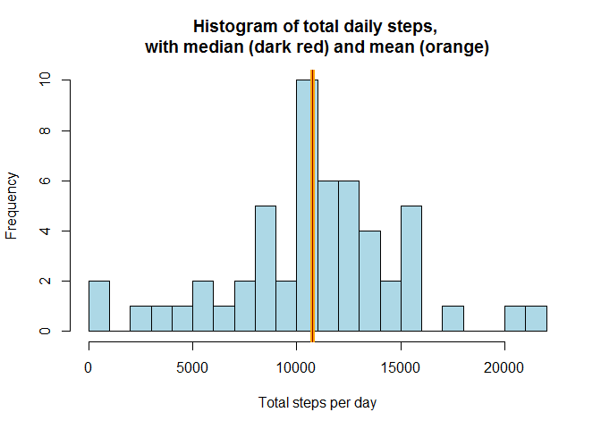
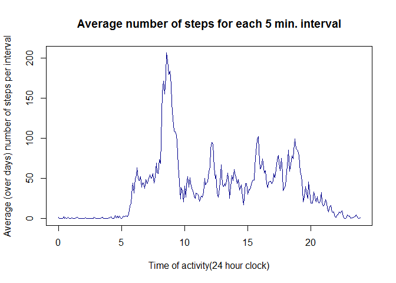
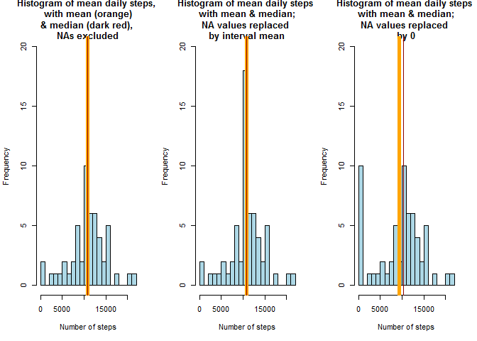
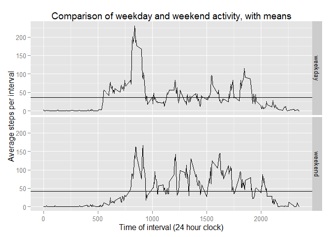

# Reproducible Research: Peer Assessment 1

## Loading and preprocessing the data


```r
# Course repdata-032.
# ASSUMES That we are executing this in the context of the GIT repository local clone, 
# so there is no need to change directories
#   oldWd <- getwd()
#   setwd("Coursera/RDevelopmentWork/RepData_PeerAssessment1")
# Trust...but verify that the file exists!
stopifnot(file.exists("activity.zip"))
# Unzip the file
unzip("activity.zip", overwrite = T)
# Again, verify that the input .csv file exitst:
stopifnot(file.exists("activity.csv"))
dfActivity = read.csv("activity.csv", header = T, sep = ",", na.strings = c("NA"))
#cleanup: convert to POSIXct date type
dfActivity$date = as.POSIXct(strptime(dfActivity$date, format = "%Y-%m-%d"))
```


## What is mean total number of steps taken per day?

```r
#part 1: examine totals by day
#part 1 instruction explicitly states to ignore NAs

dfActivityStepsByDay = aggregate(dfActivity$steps, by = list(dfActivity$date), sum)
colnames(dfActivityStepsByDay) = c("date", "steps")

#plot the histogram of total steps by day
hist(dfActivityStepsByDay$steps, breaks = 20, col = "lightBlue", plot = T,
  xlab="Total steps per day", ylab="Frequency", main="Histogram of total daily steps, \nwith median (dark red) and mean (orange)")
meanStepsByDay = mean(dfActivityStepsByDay$steps, na.rm = T)
meanStepsByDayStr = paste(signif(meanStepsByDay,6))
medianStepsByDay = median(dfActivityStepsByDay$steps, na.rm = T)
#plot the median value, mean is very close, won't show up distinctly

abline(v = meanStepsByDay, col = "orange", lwd = 5)
abline(v = medianStepsByDay, col = "darkRed")
```

 

The mean value of steps per day is 10766.2 and median value of steps per day is 10765.

## What is the average daily activity pattern?

```r
#part 2: average daily activity pattern
dfActivityStepsByInterval = aggregate(dfActivity$steps, by = list(dfActivity$interval), mean, na.rm = T)
colnames(dfActivityStepsByInterval) = c("interval", "steps")
#make a useful representation of time, converting intervals to hour and fraction of hour
dfActivityStepsByInterval$hour =  floor(dfActivityStepsByInterval$interval/100) + dfActivityStepsByInterval$interval%%100/60
plot(dfActivityStepsByInterval$steps ~ dfActivityStepsByInterval$hour, type = "l", col = "darkBlue",
     xlab = "Time of activity(24 hour clock)", ylab = "Average (over days) number of steps per interval", main = "Average number of steps for each 5 min. interval")
```

 

```r
maxActivitySteps = signif(dfActivityStepsByInterval[which.max(dfActivityStepsByInterval$steps), "steps"],4)
maxActivityInterval = dfActivityStepsByInterval[which.max(dfActivityStepsByInterval$steps), "interval"]
maxActivityClockTime = paste(floor(maxActivityInterval/100),maxActivityInterval%%100,sep=":")
maxStepsAllIntervals = signif(dfActivity[which.max(dfActivity$steps), "steps"],4)
maxStepsInterval = dfActivity[which.max(dfActivity$steps), "interval"]
maxStepsClockTime = paste(floor(maxStepsInterval/100),maxStepsInterval%%100,sep=":")
maxStepsDate = dfActivity[which.max(dfActivity$steps), "date"]
maxStepsDay = weekdays(maxStepsDate)
```
The 5-minute interval of maximum average (over all days) activity (206.2 steps) occurs at 8:35.
Interestingly, the overall maximum number of steps is 806 which occurs at 6:15 on 2012-11-27, which is a Tuesday.

## Imputing missing values

```r
#part 3: impute missing values
#let's count them
naIndicator = is.na(dfActivity$steps)
meanNaIndicator = signif(mean(naIndicator),2)
sumNaIndicator = sum(naIndicator)
```

The fraction of missing values is 0.13 and there are 2304 missing values.


```r
dfActivityMergeIntervalAvgs <- merge(dfActivity, dfActivityStepsByInterval,by = "interval")
dfActivityMergeIntervalAvgs$steps <- 
  ifelse(is.na(dfActivityMergeIntervalAvgs$steps.x), 
         dfActivityMergeIntervalAvgs$steps.y, #average for the same interval
         dfActivityMergeIntervalAvgs$steps.x)
# for comparison purposes, use 0 replacement as an alternative
dfActivityMergeIntervalAvgs$steps0 <- 
  ifelse(is.na(dfActivityMergeIntervalAvgs$steps.x), 
         0,
         dfActivityMergeIntervalAvgs$steps.x)
dfCleanActivity <- data.frame(dfActivityMergeIntervalAvgs$interval, 
                              dfActivityMergeIntervalAvgs$steps, dfActivityMergeIntervalAvgs$steps0,
                              dfActivityMergeIntervalAvgs$date, dfActivityMergeIntervalAvgs$hour)
colnames(dfCleanActivity) <- c("interval", "steps", "steps0", "date", "hour")
#summary(dfCleanActivity)

dfCleanActivityStepsByDay <- aggregate(dfCleanActivity$steps, by = list(dfCleanActivity$date), sum)
colnames(dfCleanActivityStepsByDay) <- c("date", "steps")
#summary(dfCleanActivityStepsByDay)

dfCleanActivitySteps0ByDay <- aggregate(dfCleanActivity$steps0, by = list(dfCleanActivity$date), sum)
colnames(dfCleanActivitySteps0ByDay) <- c("date", "steps0")
#summary(dfCleanActivitySteps0ByDay)
rm("dfActivityMergeIntervalAvgs")

cleanMeanStepsByDay = mean(dfCleanActivityStepsByDay$steps, na.rm = T)
cleanMeanStepsByDayStr = paste(signif(cleanMeanStepsByDay,6))
cleanMedianStepsByDay = median(dfCleanActivityStepsByDay$steps, na.rm = T)
cleanMedianStepsByDayStr = paste(signif(cleanMedianStepsByDay,6))

cleanMeanSteps0ByDay = mean(dfCleanActivitySteps0ByDay$steps0, na.rm = T)
cleanMeanSteps0ByDayStr = paste(signif(cleanMeanSteps0ByDay,6))
cleanMedianSteps0ByDay = median(dfCleanActivitySteps0ByDay$steps0, na.rm = T)
cleanMedianSteps0ByDayStr = paste(signif(cleanMedianSteps0ByDay,6))
```

We impute the NA values in two ways. First by substituting the mean value of steps in the given interval from the mean for that interval on all other days (NAs excluded). With this approach, the mean daily steps is 10766.2 and the median of daily steps is 10766.2 in the cleaned data. 

The second approach is to replace NA values with 0. Using 0-replacement, we find the mean for daily steps is reduced to 9354.23 and the median to 10395 in the cleaned data.


```r
#plot them side-by-side
par("mfrow" = c(1,3))
hist(dfActivityStepsByDay$steps, breaks = 20, col = "lightBlue", plot = T, ylim = c(0,20),
     xlab="Number of steps", ylab="Frequency", main="Histogram of mean daily steps, \nwith mean (orange)\n& median (dark red), \nNAs excluded")
abline(v = meanStepsByDay, col = "orange", lwd = 5)
abline(v = medianStepsByDay, col = "darkRed")
hist(dfCleanActivityStepsByDay$steps, breaks = 20, col = "lightBlue", plot = T, ylim = c(0,20),
     xlab="Number of steps", ylab="Frequency",
     main="Histogram of mean daily steps \n with mean & median; \nNA values replaced \nby interval mean")
abline(v = cleanMeanStepsByDay, col = "orange", lwd = 5)
abline(v = cleanMedianStepsByDay, col = "darkRed")
hist(dfCleanActivitySteps0ByDay$steps0, breaks = 20, col = "lightBlue", plot = T, ylim = c(0,20),
     xlab="Number of steps", ylab="Frequency", main="Histogram of mean daily steps \n with mean & median; \nNA values replaced \nby 0")
abline(v = cleanMeanSteps0ByDay, col = "orange", lwd = 5)
abline(v = cleanMedianSteps0ByDay, col = "darkRed")
```

 

As can be seen, there are more days reported in the 10000 step bin when we impute from interval means, but the mean number of steps per day is unchanged little from 10766.2 to 10766.2 in the cleaned data. The median steps per day are little changed, from 10765 to 10766.2 for the interval-mean imputed data.

When we use 0-replacement for NA values, we get a noticably different mean steps value of 9354.23 and a median of 10395. In this case, it appears that many of the NA intervals contributed to additional 10000 step days, Using 0-replacement strategy, these now fall into 0-step days. This appears to be a systematic pattern of NA values and invites further investigation.

## Are there differences in activity patterns between weekdays and weekends?

```r
dfCleanActivity$weekdays <- ifelse(weekdays(dfCleanActivity$date) %in% c("Saturday", "Sunday"), "weekend", "weekday")
dfCleanActivity$weekdays <- factor(dfCleanActivity$weekdays)

dfWeekActivity = split(dfCleanActivity, dfCleanActivity$weekdays)
dfWeekdayActivityByInterval = aggregate(dfWeekActivity[[1]]$steps, 
                                        by = list(dfWeekActivity[[1]]$interval), mean)
colnames(dfWeekdayActivityByInterval) = c("interval", "steps")
dfWeekendActivityByInterval = aggregate(dfWeekActivity[[2]]$steps, 
                                        by = list(dfWeekActivity[[2]]$interval), mean)
colnames(dfWeekendActivityByInterval) = c("interval", "steps")

maxWeekdayActivityInterval  = 
  dfWeekdayActivityByInterval[which.max(dfWeekdayActivityByInterval$steps), "interval"]
maxWeekdayActivityIntervalTime = 
  paste(floor(maxWeekdayActivityInterval/100), maxWeekdayActivityInterval%%100, sep = ":")
maxWeekdayActivitySteps = 
  signif(dfWeekdayActivityByInterval[which.max(dfWeekdayActivityByInterval$steps), "steps"],4)
meanWeekdayPmSteps = 
  signif(mean(
  dfWeekdayActivityByInterval[dfWeekdayActivityByInterval$interval >= 1200. &
                                dfWeekdayActivityByInterval$interval <= 1700.,
                              "steps"]),4)
meanWeekdayActivity = signif(mean(dfWeekdayActivityByInterval[,"steps"]),4)

maxWeekendActivityInterval = 
  dfWeekendActivityByInterval[which.max(dfWeekendActivityByInterval$steps), "interval"]
maxWeekendActivityIntervalTime = 
  paste(floor(maxWeekendActivityInterval/100), maxWeekendActivityInterval%%100, sep = ":")
maxWeekendActivitySteps = 
  signif(dfWeekendActivityByInterval[which.max(dfWeekendActivityByInterval$steps), "steps"], 4)
meanWeekendPmSteps = 
  signif(mean(
  dfWeekendActivityByInterval[dfWeekendActivityByInterval$interval >= 1200 & 
                                dfWeekendActivityByInterval$interval <= 1700,
                              "steps"]),4)
meanWeekendActivity = signif(mean(dfWeekendActivityByInterval[,"steps"]),4)

library(ggplot2)
q <- qplot(interval, steps, data = dfCleanActivity, stat = "summary", geom = "line",
           fun.y = mean, facets = weekdays ~ ., 
           xlab = "Time of interval (24 hour clock)", ylab = "Average steps per interval",
           main = "Comparison of weekday and weekend activity, with means")


dfHlines = data.frame(z = c(meanWeekdayActivity, meanWeekendActivity), weekdays = levels(dfCleanActivity$weekdays))
q = q + geom_hline(aes(yintercept = z), data = dfHlines)
print(q)
```

 

There appears to be a higher peak of activity (230.4 steps) in weekday mid-mornings, at 8:35, while the weekend peak is lower (166.6 steps) and occurs later, at 9:15. However, the weekend pattern shows more consistent activity in the afternoon hours, with 83.87 mean weekend afternoon activity but only 39.8 mean afternoon activity on weekdays. Indeed, there is a higher mean level of activity on the weekend: 42.37 steps compared to the weekday mean of 35.61 steps, the values of which are plotted.
